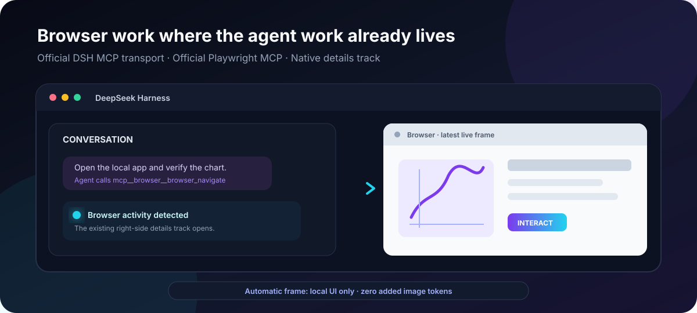

# DSH Browser Workbench

  <strong>A Codex-style live browser panel for DeepSeek Harness, powered by the official Playwright MCP.</strong>

  The agent gets real browser tools. The page appears in DSH's existing right-side details track only when the agent uses them. Automatic live frames stay out of model context.

  
  
  
  

> **Developer preview.** `0.1.0-alpha.1` is verified against DSH `0.1.2-alpha.1` on Windows. macOS and newer DSH releases are explicit compatibility gates, not implied support.

**中文简介：** 给 DeepSeek Harness 补上一套 Codex 风格的浏览器体验。模型仍使用官方 Playwright MCP 和官方 DSH MCP 客户端；只有真正调用浏览器后，页面才出现在 DSH 原生右侧详情栏。自动刷新帧只供本地 UI 展示，不会塞进模型上下文，也不会平白增加图片 token。

## Why this package exists

DSH can already consume MCP tools, and Playwright MCP already knows how to automate a browser. The missing piece is the workbench experience around them:

- **Native-feeling UI:** reuse DSH's existing details track instead of opening a permanent second application surface.
- **Official building blocks:** keep browser automation in Microsoft's `@playwright/mcp` and transport in DSH's `@deepseek-ai/dsh-mcp-client`.
- **Session-safe local files:** derive the workspace from the calling DSH Session, fence inputs and outputs, and preview local HTML through a tokenized loopback URL.
- **No hidden context tax:** refresh one bounded local frame after page-changing actions without returning that frame to the model.

This is an adapter, not another browser engine and not a replacement MCP client.

## What it feels like

1. Ask the DSH agent to open, inspect or test a page.
2. The official MCP client starts the pinned Playwright MCP lazily.
3. The browser page appears in DSH's right details column after the first browser action.
4. Fold the panel when you want more room, then reopen the same live view from the session header's **Browser** button at any time.

The latest frame is a visual status surface, not a video stream. The agent can still request ordinary Playwright screenshots when visual data must enter its context.

## Architecture at a glance

| Concern | Owner |
| --- | --- |
| Browser automation | Microsoft `@playwright/mcp` |
| MCP discovery, stdio transport and reconnect | DeepSeek Harness `@deepseek-ai/dsh-mcp-client` |
| Session workspace authority | DSH `sandboxPolicy` |
| Right-side UI surface | DSH `shell.overlay`, `conversation.session.header.utilities`, and the official details track |
| File fencing, local preview and model-invisible live frame | DSH Browser Workbench |

~~~text
Agent preset
  └─ official @deepseek-ai/dsh-mcp-client
       └─ pinned Microsoft @playwright/mcp
            └─ installed Chrome / Edge / Chromium

DSH Browser Workbench Host
  ├─ wraps mcp__browser__* registration
  ├─ binds files to sandboxPolicy(Session).workspaceRoot
  ├─ keeps the latest model-invisible frame per Session
  └─ serves a bounded same-origin long-poll route

DSH Browser Workbench Client
  └─ overlays only DSH's official right details track
~~~

There is no dependency on Exp Harness, AI Company, Smart Auto, benchmark code or a private directory layout.

## Quick start

Prerequisites: Node.js `22.19+`, PowerShell 7 on Windows, DSH `0.1.2-alpha.1`, and an installed Chrome, Edge or Chromium browser.

~~~powershell
git clone https://github.com/taiheqi718-art/dsh-browser-workbench.git
cd dsh-browser-workbench
pwsh -NoLogo -NoProfile -File .\scripts\install-direct.ps1
npm run check
dsh plugin --profile web add .
~~~

The installer clears proxy variables only for its own process tree, uses the npm registry directly, skips lifecycle scripts and disables Playwright browser downloads. It does not change the system proxy or global npm settings.

Configure one absolute runtime root:

~~~powershell
$env:DSH_BROWSER_WORKBENCH_RUNTIME = 'E:\dsh-runtime\browser-workbench'
~~~

`DSH_BROWSER_EXECUTABLE` is optional; the plugin detects Chrome, Edge or Chromium in standard Windows, macOS and Linux locations. If the dedicated runtime variable is omitted, the plugin uses `DSH_HOME/browser-workbench`. It fails loudly when neither location exists instead of loading a Client that repeatedly polls a missing Host route.

Add the row in [`agent.cordis.yml`](./agent.cordis.yml) to each Agent preset that should receive browser tools, then check the active environment:

~~~powershell
npm run build
npm run doctor
~~~

The package intentionally does not rewrite existing Agent presets. Presets are user-owned compositions; silently replacing one could remove its tools, permissions or model policy. The included row consumes the Host-resolved `dshBrowserWorkbench` service, so it contains no machine path and invokes no `npx`.

Built Host artifacts are committed with the source. DSH can install the plugin directly from Git without executing an unreviewed `prepare` hook; CI rebuilds them and rejects stale output.

## Features

- Browser tools start lazily through the official DSH MCP bridge.
- Each call is bound to the calling Session workspace.
- Screenshot, PDF, console, network and storage-state outputs are staged and copied through a symlink-aware workspace fence.
- Uploads and storage-state inputs must come from the current Session workspace and are size-bounded.
- A local HTML file is previewed through a random, loopback-only URL; unrestricted browser file access stays disabled.
- Successful page actions refresh a bounded in-memory frame for the UI. This automatic frame is not sent to the model and adds no image tokens.
- Codex-style panel lifecycle: first browser activity opens DSH's existing details column; closing only folds it, the session header can reopen the last live frame, and the next model browser action focuses it again.
- Optional exact-origin request policy for a Host that needs per-Session network leases.

## Security boundaries

- The Client submits only `sessionId`, `afterRevision` and a bounded wait duration. It cannot choose a workspace path, browser endpoint or MCP argument.
- The Host derives the workspace from DSH's Session and sandbox policy.
- Inputs and outputs are checked through real paths and deepest-existing ancestors, blocking junction and symlink escapes.
- Unknown future Playwright tools with an unclassified `filename` fail closed.
- Playwright runs with `--isolated`, `--block-service-workers`, `--headless` and without `--allow-unrestricted-file-access`.
- Runtime state, browser profile, cache, temporary files and output staging stay below the configured runtime root.

This protects the DSH-to-browser file boundary. It is not an operating-system sandbox for hostile browser binaries or malicious websites. Please report security issues through GitHub's private security advisory flow; see [`SECURITY.md`](./SECURITY.md).

## Cost and performance

The adapter makes no model calls. It adds one local screenshot after page-changing browser actions when live capture is enabled. That screenshot is kept in bounded memory and is not included in model context. Model-requested screenshots and browser tool schemas still have their ordinary context cost.

## Compatibility

| Environment | Status |
| --- | --- |
| DSH `0.1.2-alpha.1` + Windows + system Edge | Verified end to end |
| Chrome / Chromium discovery on Windows | Covered by runtime checks |
| macOS launch, reload and multi-Session isolation | Testers wanted |
| DSH `0.1.2-alpha.2` or newer | Not yet claimed |

The full evidence record is in [`docs/verification-2026-09-06.md`](./docs/verification-2026-09-06.md).

## Current limitations

- The panel shows the latest frame, not a video stream.
- Human mouse and keyboard takeover inside the frame is not implemented.
- An Agent preset must opt in to the official MCP row.
- The first stable release still requires macOS and newer-DSH compatibility verification.

## Development

~~~powershell
npm run build
npm test
npm pack --dry-run
~~~

Tests cover Session fencing, staged I/O cleanup, local preview, hidden live capture, request policies, controller disposal, runtime resolution, bundle isolation, the Client overlay, and its per-session reopen control.

With an official DSH Alpha1 source checkout already built:

~~~powershell
npm run verify:dsh-alpha1 -- --source E:\path\to\deepseek-harness
~~~

This starts no model request. It composes the official Alpha1 `ToolRuntime` and `dsh-mcp-client` with this plugin, drives the pinned Playwright MCP against the installed system browser, verifies a hidden frame and a Session-fenced screenshot, then removes its project-local fixture.

Contributions are welcome, especially compatibility reports from macOS and newer DSH releases. See [`CONTRIBUTING.md`](./CONTRIBUTING.md).

## License

MIT. Microsoft Playwright MCP remains separately licensed under Apache-2.0.
